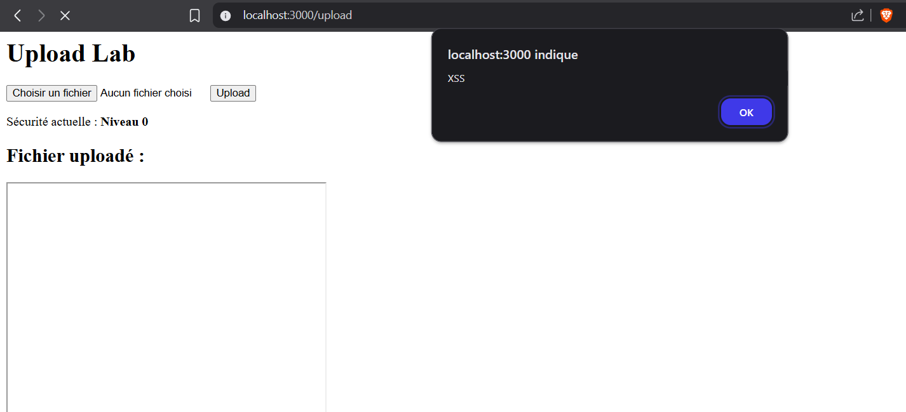
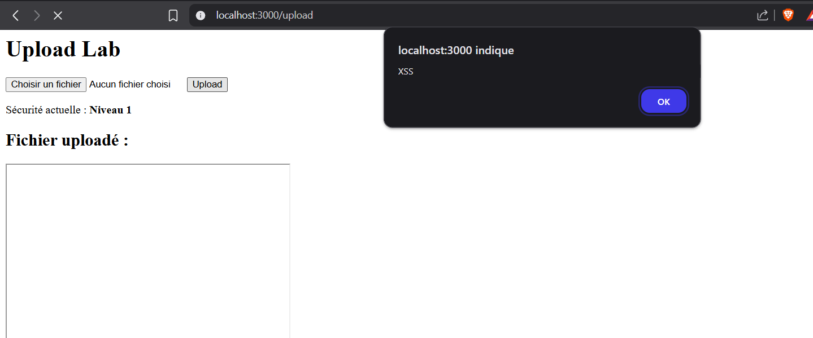
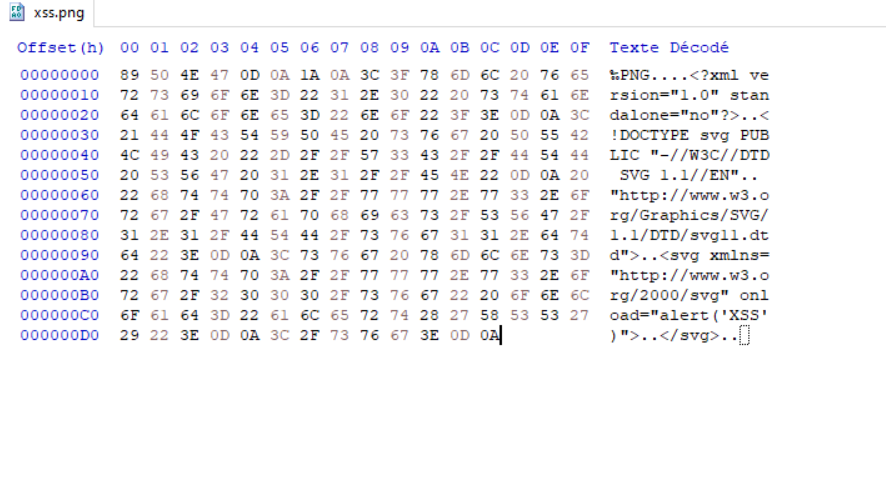

# 🧪 Lab vulnérable File Upload multi-niveaux

Ce projet est un laboratoire de test avec plusieurs niveaux de vulnérabilités de type d'upload de fichier, construit avec Node.js.

---

## 🎯 Objectifs

- Comprendre les vecteurs d'attaque liés aux fichiers uploadés
- Visualiser les différents niveaux de sécurisation possibles
- Apprendre à bypasser des protections naïves (extension, MIME, content-type)
- Appliquer des contre-mesures solides en backend

---

## 🔐 Niveaux

- Niveau 0 : Aucun filtre
- Niveau 1 : Filtrage par extension (client)
- Niveau 2 : Vérification du type MIME (serveur)
- Niveau 3 : Sécurisation du rendu

---

## ✅ Prérequis

- Node.js (version 18+ recommandée)   
- Un fichier `.env` avec une variable SECURITY 

---

## ⚙️ Installation

1. Clonez ce dépôt :

   ```bash
   git clone https://github.com/AledMikuinIt/XXXXXX.git
   cd upload-lab
   
2. Installez les dépendances backend :

   ```bash
   npm install
   
3. Installez les dépendances backend :

   ```bash
   npm run dev

Note : Assurez-vous que la variable .env est correctement configurée.

## 🧠 Explication du fonctionnement

# 🔓 Niveau 0

Aucune vérification n'est effectuée. Vous pouvez uploader n'importe quel fichier, y compris malveillant (PHP, SVG, etc.).
J'ai donc fait un fichier .svg avec le code suivant :

```bash
<svg xmlns="http://www.w3.org/2000/svg" onload="alert('XSS')">
</svg>
```
Le script s'exécute dès l'affichage car le SVG est directement rendu via index.ejs.



# 🚧 Niveau 1

Un filtrage basique est appliqué côté client : seules certaines extensions sont autorisées (.png, .jpg, etc.).

Pour contourner cette protection, il suffit de déguiser un fichier malveillant, par exemple :

- Fichier d'origine : xss.svg
- Fichier déguisé : xss.svg.jpg

Ensuite, un header Content-Type est forcé dans le code (démo uniquement) :

```
  if (securityLevel === 1) {
    res.setHeader('Content-Type', 'image/svg+xml'); 
  }
```
Cela permet au navigateur d’interpréter le contenu comme un SVG et d’exécuter le code malveillant. 
Ce qui est assez courant dans des applications réelles pour permettre d'être plus flexible dans l'affichage des images.



# 🔬 Niveau 2

Le serveur lit les magic bytes pour vérifier le MIME type réel du fichier uploadé grâce à la bibliothèque file-type.

Exemple de contournement : un fichier polyglotte PNG/SVG :

- Le fichier commence par des headers PNG valides.
- Le contenu reste du SVG malveillant.
- Généré via un script Python.

Cela permet de tromper la détection côté serveur et d’uploader un fichier malveillant. 
En revanche, comme le fichier est interprété comme une image PNG par le navigateur,
le JavaScript contenu dans le SVG n’est **pas exécuté**. Cela illustre qu’un bypass MIME ne suffit pas à compromettre un client si le navigateur suit bien le type MIME.

📎 Note : Pour rendre l'attaque exploitable (ex. XSS), il faudrait une configuration côté serveur 
qui serve le fichier avec `Content-Type: image/svg+xml` malgré le bypass MIME mais aussi avoir le rendu sur le navigauteur — 
ce qui serait une mauvaise pratique.

### Exemple Polyglotte
Ici j'ai modifié le svg pour lui donner une signature (magic bytes) png `89 50 4E 47 0D 0A 1A 0A`.



# 🛡️ Niveau 3

Ajout de protections supplémentaires :
- Forçage du Content-Type: text/plain pour désactiver tout rendu HTML/SVG. Le code ne sera donc pas exécuté, mais simplement affiché en clair.
- Header X-Content-Type-Options: nosniff pour empêcher l'interprétation automatique par le navigateur.

Ces mécanismes bloquent l’exécution de scripts embarqués, même en cas d’upload réussi.


# 📊 Tableau comparatif 


| Niveau | Filtrage extension | Vérif. MIME | Protection navigateur | Exécution possible |
|--------|--------------------|-------------|------------------------|--------------------|
| 0      | ❌                 | ❌          | ❌                     | ✅                 |
| 1      | ✅ (client only)   | ❌          | ❌                     | ✅ (via header)    |
| 2      | ✅                 | ✅          | ❌                     | ✅ (polyglotte)    |
| 3      | ✅                 | ✅          | ✅                     | ❌                 |


## 🕵️ Cas d’usage réel

Des failles d’upload mal sécurisé sont souvent utilisées pour :
- Uploader des webshells ou reverse shells sur un serveur
- Exécuter du code JS dans le navigateur d’un admin (via SVG/XSS)
- Réaliser des attaques SSRF ou LFI en contournant les protections MIME


## ✅ Résumé

Ce lab montre qu’une protection “visuelle” (comme le filtrage client) est triviale à contourner, et que seul un ensemble de mécanismes combinés (MIME check, stockage contrôlé, headers de protection) permet une défense réellement robuste.


## 🚀 Pistes d'amélioration

- Ajouter un antivirus côté serveur (ex: ClamAV)
- Générer un hash SHA256 et renommer tous les fichiers uploadés
- Isoler les fichiers dans un conteneur ou bucket S3
- Stocker les fichiers hors du répertoire servi par Express
